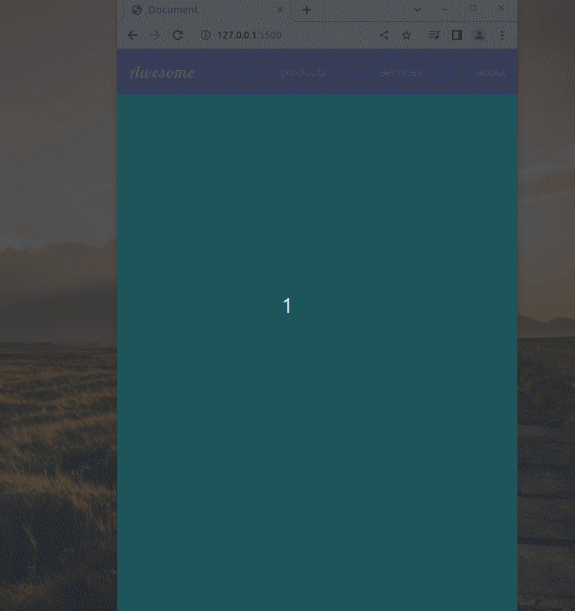

# Burger navbar with css only

- try to get similar result to the picture
- use hidden checkbox and css media queries
- use media query so the burger appear and the nav items disappear when screen is smaller than 500px
- use the checkbox :checked pseudo class to make the nav list appear again but with column style

